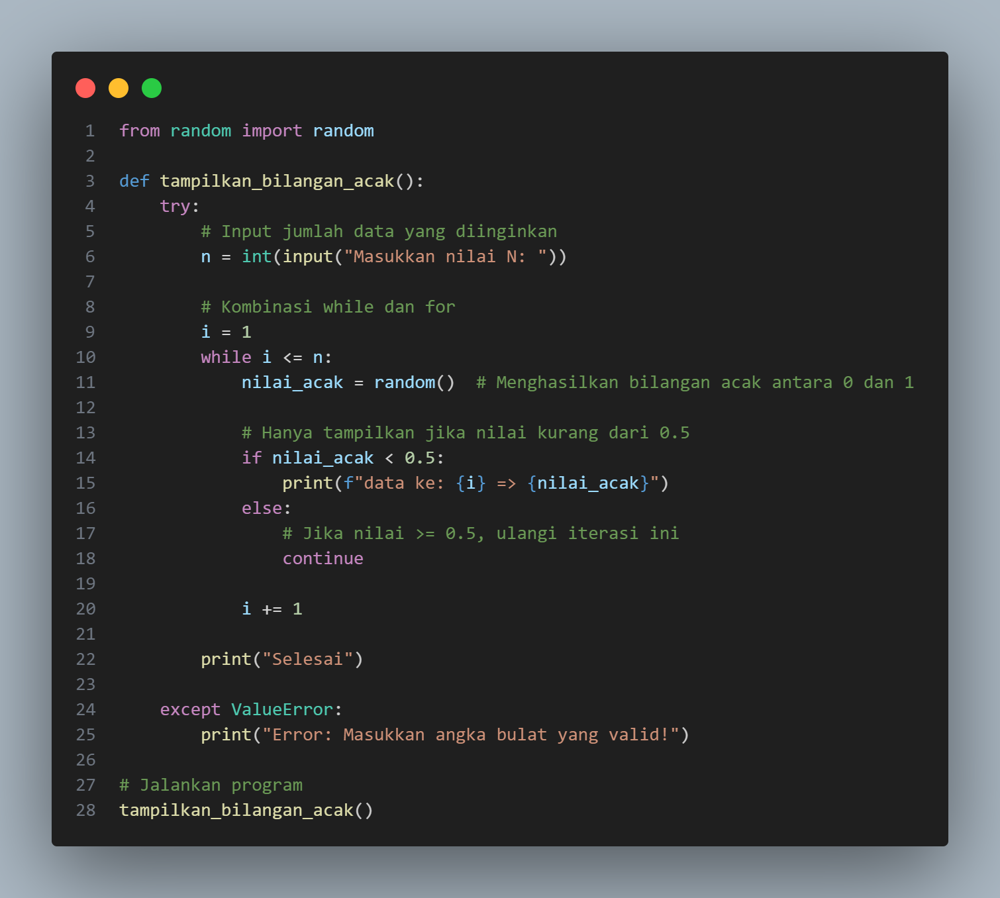
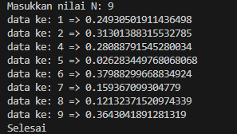

# labpy-03
# Data Diri

Nama : Zizantara Arzeva Cakra Kahana 

NIM : 312410398

Kelas : TI,24.A.3

# Latihan 1

# Program di atas memiliki fitur-fitur berikut:

1. Import fungsi random() dari modul random
2. Input nilai n dari user saat runtime
3. Validasi input:

* Memastikan input adalah angka
* Memastikan input lebih besar dari 0

4. Kombinasi while dan for:

* While untuk mengontrol jumlah iterasi
* Kondisional untuk memeriksa bilangan < 0.5

5. Menampilkan bilangan acak dengan format yang sesuai